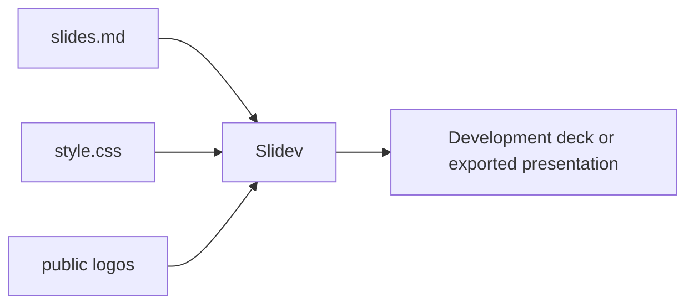

# How to Vibe Code at Hackathons

Slidev presentation for the CSU Bakersfield Software Engineering Club about agentic AI coding at hackathons.

> [!TIP]
> Edit `slides.md` for presentation content and `style.css` for deck styling; use the Slidev commands in this README to build or export the result.


<p align="center">
  
</p>

## Overview

The deck introduces a progression from smarter prompts to editor tab completion and agentic coding. It includes examples of ideation, debugging, code understanding, Cursor, and agent-based development.

## Contents

- About the presenter and selected organizations
- The three-stage “Ladder” from prompts to agents
- Prompt examples for ideation, debugging, and understanding code
- Tab completion and Cursor examples
- Agentic coding tools and workflow guidance

## Getting started

```bash
npm install
npm run dev
```

Build the deck with `npm run build` or export it with `npm run export`. The source presentation is `slides.md`; custom styling is in `style.css`.

## Preview / Media

No exported deck, slide image, or other verified visual preview is present in the tracked files; the repository contains the Slidev source and logo assets.

## Status and attribution

This is a presentation source repository. Logos in `public/logos/` are third-party marks and retain their respective rights. No license is declared.

## Presentation flow


