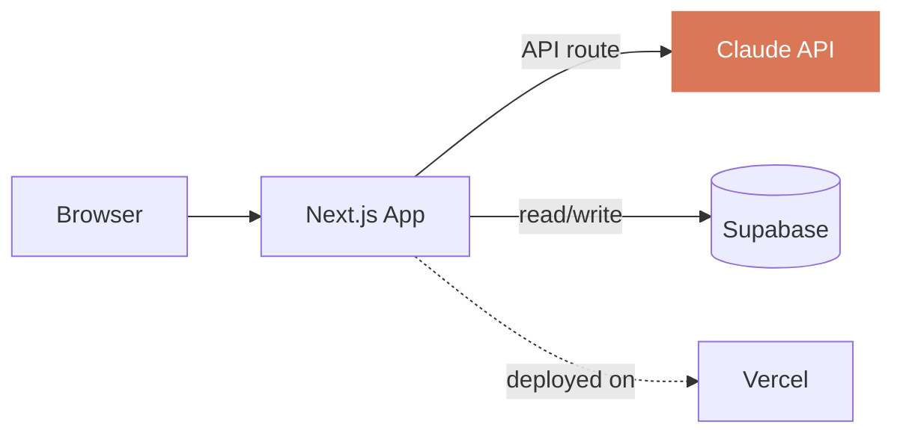

<div class="flex flex-col items-center justify-center h-full">
  <p class="eyebrow mb-6">CSUB · Software Engineering Club</p>
  <h1 v-motion :initial="{ y: 30, opacity: 0 }" :enter="{ y: 0, opacity: 1, transition: { delay: 100, duration: 600 } }" class="!text-7xl !leading-none">
    How to Vibe Code <br/><span class="kicker">at Hackathons</span>
  </h1>
  <p v-motion :initial="{ y: 20, opacity: 0 }" :enter="{ y: 0, opacity: 1, transition: { delay: 400, duration: 600 } }" class="!text-lg opacity-50 mt-12">
    Noah Gallego
  </p>
</div>

---
layout: center
class: text-center
---

<p class="eyebrow mb-16">A Bit About Me</p>

<div class="flex items-center justify-center gap-16">
  
  
  
  
</div>

---
layout: center
---

<p class="eyebrow mb-8 text-center">The Ladder</p>

<div class="max-w-2xl mx-auto space-y-5">

<div class="flex items-baseline gap-6">
  <p class="rung-num">01</p>
  <div class="flex-1">
    <h2 class="!text-2xl !mb-0">Smarter Prompts</h2>
    <p class="!text-sm opacity-60">Use ChatGPT well.</p>
  </div>
</div>

<div class="divider"></div>

<div v-click class="flex items-baseline gap-6">
  <p class="rung-num">02</p>
  <div class="flex-1">
    <h2 class="!text-2xl !mb-0">Tab Completion</h2>
    <p class="!text-sm opacity-60">The IDE finishes your thoughts.</p>
  </div>
</div>

<div class="divider" v-click></div>

<div v-click class="flex items-baseline gap-6">
  <p class="rung-num">03</p>
  <div class="flex-1">
    <h2 class="!text-2xl !mb-0">Agentic Coding</h2>
    <p class="!text-sm opacity-60">It writes, runs, and fixes the code.</p>
  </div>
</div>

</div>

---
layout: center
class: text-center
---

<p class="rung-num mb-8">01</p>

<h1 class="!text-6xl">Smarter Prompts</h1>

<div class="mt-16 flex justify-center">
  
</div>

---
layout: center
---

<p class="eyebrow mb-6 text-center">Three Prompts to Try</p>

<div class="space-y-3 max-w-3xl mx-auto">

<div v-click class="card !py-3 !px-5">
  <p class="eyebrow !text-[9px] mb-1 kicker">Ideation</p>
  <p class="!text-sm !leading-snug">"Give me 5 hackathon ideas for a healthcare project I can build in 24 hours."</p>
</div>

<div v-click class="card !py-3 !px-5">
  <p class="eyebrow !text-[9px] mb-1 kicker">Debugging</p>
  <p class="!text-sm !leading-snug">"Help me fix this PHP error I keep getting."</p>
</div>

<div v-click class="card !py-3 !px-5">
  <p class="eyebrow !text-[9px] mb-1 kicker">Understanding</p>
  <p class="!text-sm !leading-snug">"Explain what this code does line by line."</p>
</div>

</div>

---
layout: center
class: text-center
---

<p class="rung-num mb-8">02</p>

<h1 class="!text-6xl">Tab Completion</h1>

<p class="!text-xl opacity-60 mt-10 max-w-xl mx-auto">
  Your editor reads what you're writing and finishes the line — sometimes the whole function.
</p>

---
layout: two-cols
---

<div class="h-full flex flex-col justify-center pr-10">
  
  <h2 class="!text-4xl !mb-4">Cursor</h2>
  <p class="!text-lg opacity-70 mb-8">An editor (a fork of VS Code) that knows your codebase.</p>

  <div v-click="2" class="card">
    <p class="eyebrow !text-[10px] mb-2 kicker">Free for Students</p>
    <p class="!text-base">One year of Cursor Pro. Verify with your <code>.edu</code> email.</p>
    <p class="!text-xs opacity-50 mt-2">cursor.com/students</p>
  </div>
</div>

::right::

<div class="h-full flex items-center justify-center">

<div>

````md magic-move

```ts
function getTrips(userId: string) {

}
```

```ts
function getTrips(userId: string) {
  return supabase
    .from('trips')
    .select('*, owner:users(*)')
    .eq('owner_id', userId)
    .order('created_at', { ascending: false });
}
```

````

<p class="!text-xs opacity-40 mt-6 text-center">Click. Cursor finishes the function.</p>

</div>

</div>

---
layout: center
class: text-center
---

<p class="rung-num mb-8">03</p>

<h1 class="!text-6xl">Agentic Coding</h1>

<p class="!text-xl opacity-60 mt-10 max-w-2xl mx-auto">
  You describe the outcome. The agent writes the code, runs it, reads the errors, fixes them, and tells you when it's done.
</p>

---
layout: center
class: text-center
---

<p class="eyebrow mb-12">The Tools</p>

<div class="flex items-stretch justify-center gap-12 max-w-5xl mx-auto">

<div v-click class="flex flex-col items-center gap-4 flex-1">
  
  <p class="!text-lg !font-semibold">Cursor</p>
  <p class="!text-sm opacity-60 text-center">An IDE that knows your code.</p>
</div>

<div v-click class="flex flex-col items-center gap-4 flex-1">
  
  <p class="!text-lg !font-semibold">Claude Code</p>
  <p class="!text-sm opacity-60 text-center">Agentic CLI in your terminal.</p>
</div>

<div v-click class="flex flex-col items-center gap-4 flex-1">
  
  <p class="!text-lg !font-semibold">Codex</p>
  <p class="!text-sm opacity-60 text-center">OpenAI's terminal agent.</p>
</div>

</div>

---
layout: center
---

<p class="eyebrow mb-12 text-center">How They Work — Three Building Blocks</p>

<div class="grid grid-cols-3 gap-6 max-w-4xl mx-auto">

<div v-click class="card text-center">
  <div class="i-carbon-document w-10 h-10 mx-auto mb-3 kicker"></div>
  <p class="!font-semibold mb-1">AGENTS.md</p>
  <p class="!text-xs opacity-60">A note you leave the AI in your repo.</p>
</div>

<div v-click class="card text-center">
  <div class="i-carbon-flash w-10 h-10 mx-auto mb-3 kicker"></div>
  <p class="!font-semibold mb-1">Skills</p>
  <p class="!text-xs opacity-60">Reusable playbooks the AI loads on demand.</p>
</div>

<div v-click class="card text-center">
  <div class="i-carbon-plug w-10 h-10 mx-auto mb-3 kicker"></div>
  <p class="!font-semibold mb-1">MCPs</p>
  <p class="!text-xs opacity-60">A standard for plugging tools into the AI.</p>
</div>

</div>

---
layout: center
---

<p class="eyebrow mb-6 text-center">First, Markdown</p>

<h2 class="!text-4xl text-center !mb-10">Plain text with a few rules.</h2>

<div class="max-w-2xl mx-auto">

```md
# Project Notes

- **Bold** and *italic*
- `inline code`
- [Links](https://example.com)
```

<p class="!text-base opacity-60 text-center mt-10">
  Readable as raw text. Diff-friendly in Git. Renders everywhere.
</p>

</div>

---
layout: center
---

<p class="eyebrow mb-6 text-center">Building Block · 01</p>

<h1 class="!text-6xl text-center !mb-10"><code class="!bg-transparent kicker !text-6xl">AGENTS.md</code></h1>

<div class="max-w-3xl mx-auto">

<p class="!text-lg opacity-70 text-center mb-8">
  A markdown file at your project root. Cursor, Claude Code, and Codex all read it at the start of every session.
</p>

```md
# Travyl

Stack: Next.js + Supabase + Vercel.

- Never commit to main; use feature branches.
- Prefer server components.
- Run `bun test` before claiming done.
```

<p v-click class="!text-sm opacity-50 text-center mt-8">
  Persistent project memory across every session.
</p>

</div>

---
layout: center
---

<p class="eyebrow mb-6 text-center">Building Block · 02</p>

<h1 class="!text-6xl text-center !mb-10">Skills</h1>

<div class="max-w-3xl mx-auto">

<p class="!text-lg opacity-70 text-center mb-10">
  A folder with a <code>SKILL.md</code> file. Claude reads the description and loads the skill when a task matches.
</p>

<div class="grid grid-cols-2 gap-3">
  <div v-click class="card !py-3"><p class="!font-mono !text-sm">brainstorming</p></div>
  <div v-click class="card !py-3"><p class="!font-mono !text-sm">debugging</p></div>
  <div v-click class="card !py-3"><p class="!font-mono !text-sm">writing-tests</p></div>
  <div v-click class="card !py-3"><p class="!font-mono !text-sm">code-review</p></div>
</div>

<p v-click class="!text-sm opacity-50 text-center mt-10">
  Bundle prompts, scripts, and reference files Claude pulls in on demand.
</p>

</div>

---
layout: center
class: text-center
---

<p class="eyebrow mb-6">Building Block · 03</p>

<h1 class="!text-6xl">MCPs</h1>

<p class="!text-2xl opacity-60 mt-4">Model Context Protocol</p>

<p v-click class="!text-3xl !font-bold mt-14 kicker">USB-C for AI.</p>

<p v-click class="!text-base opacity-60 mt-10 max-w-2xl mx-auto">
  One standard. Any compatible client (Claude, Cursor, ChatGPT) can plug into any tool, database, or API.
</p>

---
layout: center
---

<p class="eyebrow mb-10 text-center">How MCPs Work</p>

<div class="flex items-center justify-between max-w-5xl mx-auto px-6">

  <div class="flex flex-col items-center gap-2">
    <div class="i-carbon-user w-12 h-12 opacity-70"></div>
    <p class="!text-sm opacity-70">You</p>
  </div>

  <div class="flex-1 mx-4 h-px bg-gray-300"></div>

  <div class="flex flex-col items-center gap-3 px-8 py-5 rounded-2xl" style="border: 2px solid #D97757; background: rgba(217,119,87,0.06);">
    <div class="i-carbon-bot w-12 h-12 kicker"></div>
    <p class="!text-sm !font-semibold kicker">Agent</p>
  </div>

  <div class="flex-1 mx-4 h-px bg-gray-300"></div>

  <div class="grid grid-cols-2 gap-2">
    <div v-click class="card !py-2 !px-3 flex items-center gap-2">
      <div class="i-simple-icons-linear w-4 h-4"></div>
      <p class="!text-xs">Linear</p>
    </div>
    <div v-click class="card !py-2 !px-3 flex items-center gap-2">
      <div class="i-simple-icons-excalidraw w-4 h-4"></div>
      <p class="!text-xs">Excalidraw</p>
    </div>
    <div v-click class="card !py-2 !px-3 flex items-center gap-2">
      <div class="i-simple-icons-supabase w-4 h-4"></div>
      <p class="!text-xs">Supabase</p>
    </div>
    <div v-click class="card !py-2 !px-3 flex items-center gap-2">
      <div class="i-simple-icons-playwright w-4 h-4"></div>
      <p class="!text-xs">Playwright</p>
    </div>
  </div>

</div>

<p v-click class="!text-base opacity-60 text-center mt-12 max-w-2xl mx-auto">
  One conversation. Many tools. The agent decides which to reach for.
</p>

<div v-click class="flex justify-center gap-3 mt-6">
  <span class="px-3 py-1 rounded-full !text-xs opacity-70" style="border: 1px solid rgba(0,0,0,0.12);"><code class="!text-xs !bg-transparent">stdio</code></span>
  <span class="px-3 py-1 rounded-full !text-xs opacity-70" style="border: 1px solid rgba(0,0,0,0.12);"><code class="!text-xs !bg-transparent">HTTP+SSE</code></span>
  <span class="px-3 py-1 rounded-full !text-xs opacity-70" style="border: 1px solid rgba(0,0,0,0.12);"><code class="!text-xs !bg-transparent">streaming HTTP</code></span>
</div>

<p v-click class="!text-xs opacity-40 text-center mt-4 max-w-xl mx-auto">
  Same protocol. Local subprocess or remote server, the agent doesn't care.
</p>

---
layout: center
---

<p class="eyebrow mb-12 text-center">MCPs in Action</p>

<div class="grid grid-cols-2 gap-5 max-w-4xl mx-auto">

<div v-click class="card">
  <div class="flex items-center gap-3 mb-2">
    <div class="i-simple-icons-linear w-6 h-6"></div>
    <p class="!font-semibold">Linear</p>
  </div>
  <p class="!text-xs opacity-60">"Close the bug I just fixed and link the PR."</p>
</div>

<div v-click class="card">
  <div class="flex items-center gap-3 mb-2">
    <div class="i-simple-icons-excalidraw w-6 h-6"></div>
    <p class="!font-semibold">Excalidraw</p>
  </div>
  <p class="!text-xs opacity-60">"Draft the architecture diagram for the flashcards app."</p>
</div>

<div v-click class="card">
  <div class="flex items-center gap-3 mb-2">
    <div class="i-simple-icons-supabase w-6 h-6"></div>
    <p class="!font-semibold">Supabase</p>
  </div>
  <p class="!text-xs opacity-60">"Spin up a flashcards table with these columns."</p>
</div>

<div v-click class="card">
  <div class="flex items-center gap-3 mb-2">
    <div class="i-simple-icons-playwright w-6 h-6"></div>
    <p class="!font-semibold">Playwright</p>
  </div>
  <p class="!text-xs opacity-60">"Open the deployed site and screenshot the broken page."</p>
</div>

</div>


---
layout: center
class: text-center
---

<h1 v-motion :initial="{ scale: 0.85, opacity: 0 }" :enter="{ scale: 1, opacity: 1, transition: { duration: 600, type: 'spring' } }" class="!text-8xl">Demo</h1>

---
layout: center
---

<p class="eyebrow mb-10 text-center">Recommended Stack</p>

<div class="grid grid-cols-4 gap-5 max-w-6xl mx-auto px-4">

<div v-click class="flex flex-col items-center text-center gap-3">
  
  <p class="!text-base !font-semibold !mb-0">Next.js</p>
  <p class="!text-xs opacity-60 !leading-snug">React framework. Pages, API routes, the whole frontend in one place.</p>
</div>

<div v-click class="flex flex-col items-center text-center gap-3">
  
  <p class="!text-base !font-semibold !mb-0">Supabase</p>
  <p class="!text-xs opacity-60 !leading-snug">Open-source Firebase. Postgres + auth + storage + realtime. Free tier is generous.</p>
</div>

<div v-click class="flex flex-col items-center text-center gap-3">
  
  <p class="!text-base !font-semibold !mb-0">Vercel</p>
  <p class="!text-xs opacity-60 !leading-snug">Deploy in 30 seconds. <code>git push</code> ships your site. Free for hobby.</p>
</div>

<div v-click class="flex flex-col items-center text-center gap-3">
  
  <p class="!text-base !font-semibold !mb-0">Claude API</p>
  <p class="!text-xs opacity-60 !leading-snug">One <code>POST</code> request. Get back text, JSON, whatever you ask for.</p>
</div>

</div>


---
layout: center
---

<p class="eyebrow mb-10 text-center">The Architecture</p>

<div class="max-w-4xl mx-auto">



<p class="!text-sm opacity-50 text-center mt-10">
  Paste notes → LLM generates flashcards → save to DB → flip and study.
</p>

</div>

---
layout: center
class: text-center
---

<h1 v-motion :initial="{ x: -100, opacity: 0 }" :enter="{ x: 0, opacity: 1, transition: { duration: 700, type: 'spring' } }" class="!text-9xl kicker">→</h1>

---
layout: center
class: text-center
---

<p class="eyebrow mb-10">Resources</p>

<div class="space-y-3 opacity-80">
  <p class="!text-lg">cursor.com/students</p>
  <p class="!text-lg">claude.com/code</p>
  <p class="!text-lg">supabase.com · vercel.com</p>
</div>

<p class="!text-sm opacity-40 mt-20">Noah Gallego</p>
